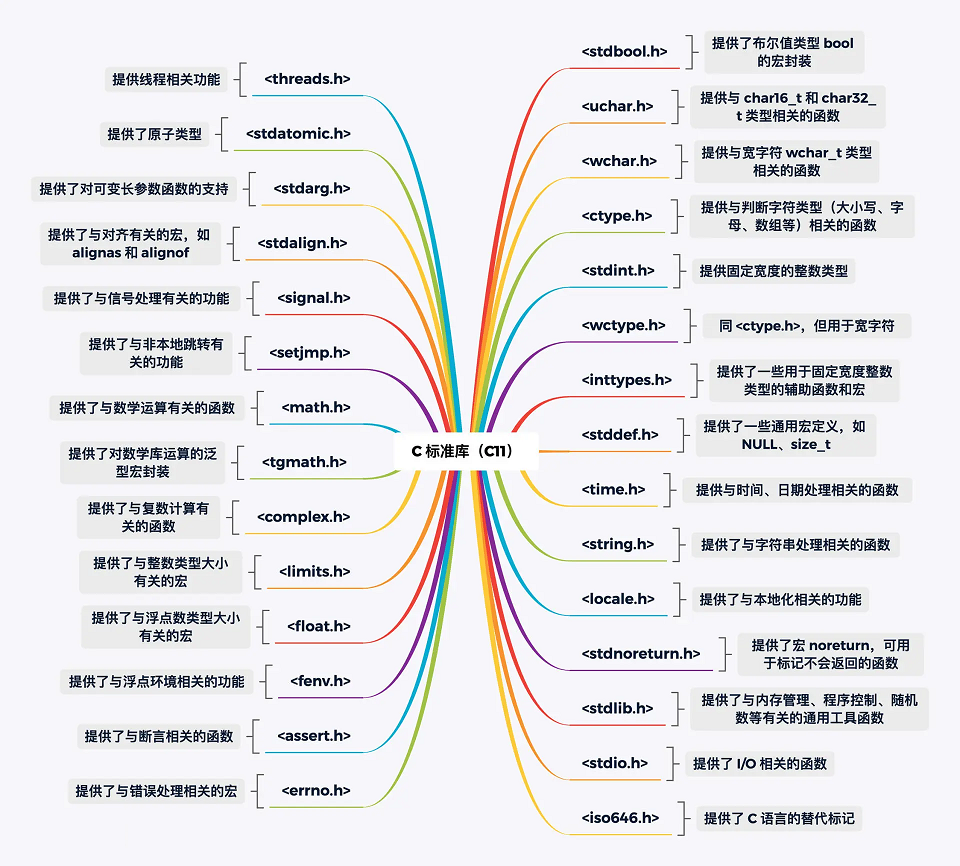

# hello-c
learn c

## Reference

C online build: https://godbolt.org/

C course on Geektime: https://github.com/Becavalier/geektime-c

C in geeks https://www.geeksforgeeks.org/c-programming-language

## C Standard Library

C Standard Library Reference: https://cplusplus.com/reference/clibrary/

